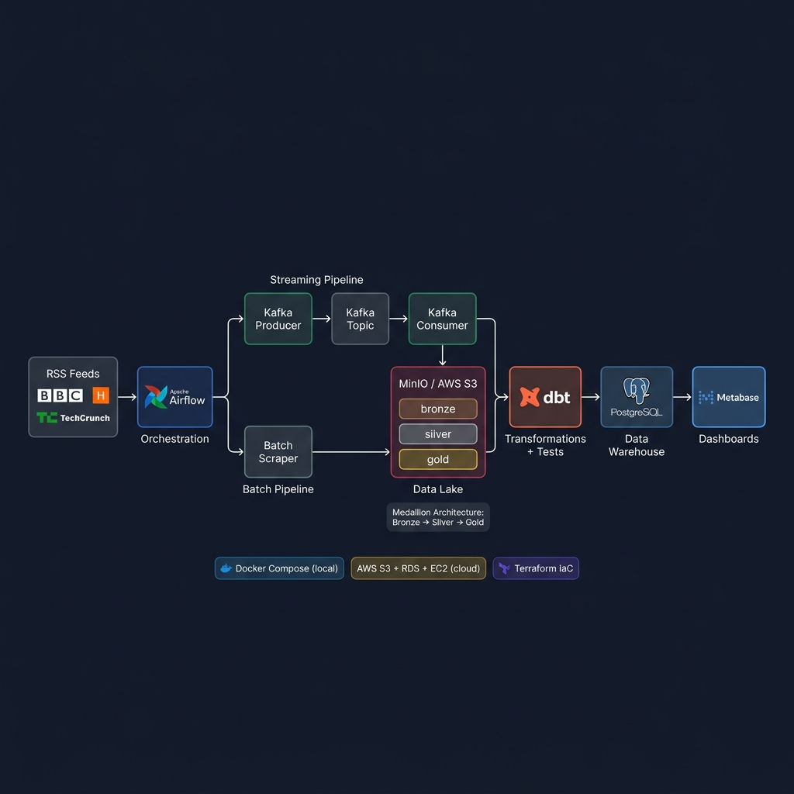
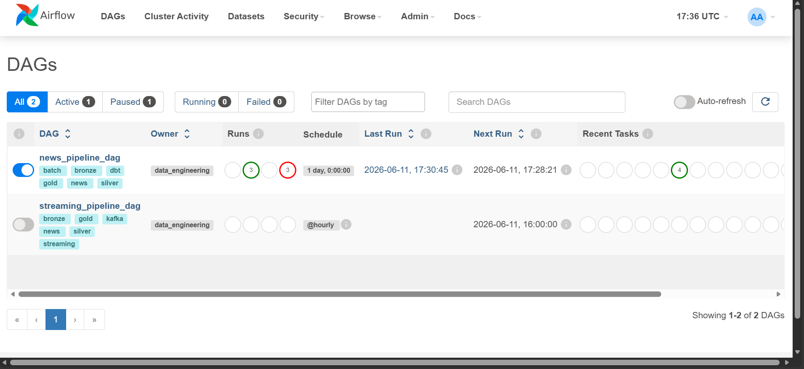
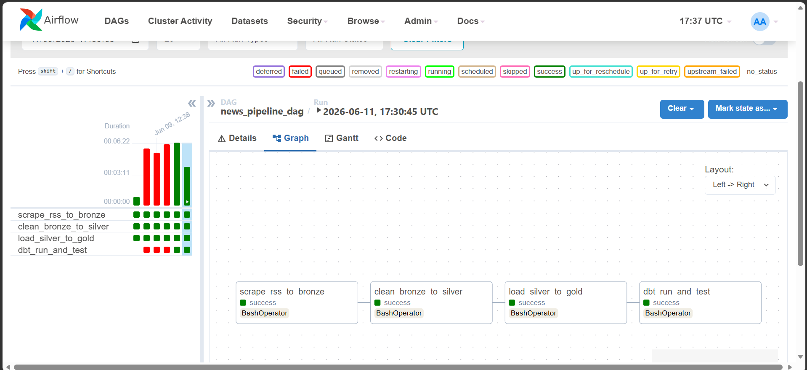
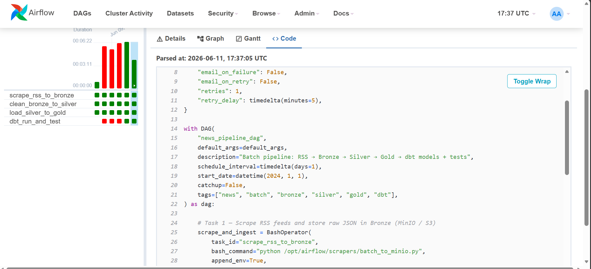

<div align="center">

# News Data Platform

### End-to-end data engineering pipeline — Medallion Architecture


</div>

---

## Architecture



The pipeline follows the **Medallion (Bronze / Silver / Gold)** pattern — a layered approach where data gets progressively cleaner and more structured as it moves downstream.

---

## Screenshots

**Airflow — both pipelines registered (batch + streaming)**


**Airflow — batch pipeline run: all 4 tasks successful**


**Airflow — DAG source code live view**



| Layer | Storage | What's in it |
|---|---|---|
| **Bronze** | MinIO / AWS S3 | Raw JSON as scraped — nothing touched |
| **Silver** | MinIO / AWS S3 | HTML stripped, whitespace collapsed, deduplication flag added |
| **Gold** | PostgreSQL / AWS RDS | Clean rows ready for SQL queries and dashboards |
| **Marts** | PostgreSQL (dbt) | Pre-aggregated views by source, category, and time |

---

## Tech Stack

| Tool | Role |
|---|---|
| **Apache Airflow 2.7** | Orchestrates both pipelines (batch DAG runs daily, streaming DAG hourly) |
| **Apache Kafka** | Message queue for the real-time ingestion path |
| **MinIO / AWS S3** | S3-compatible data lake — same pipeline code works locally and on AWS |
| **dbt Core** | SQL transformations and automated data quality tests |
| **PostgreSQL 15** | Gold layer warehouse |
| **Metabase** | Self-hosted BI dashboards, auto-provisioned via REST API on first start |
| **Docker Compose** | Spins up the entire local stack with one command |
| **Terraform** | Provisions the full AWS environment (EC2, RDS, S3, IAM, VPC) |
| **Python / BeautifulSoup** | RSS scraping and HTML cleaning |

---

## Running Locally

### Prerequisites
- Docker Desktop

### Setup

```bash
git clone https://github.com/talib-adnane/news-data-platform.git
cd news-data-platform
cp .env.example .env
```

The defaults in `.env.example` work out of the box for local development.

```bash
docker-compose up -d
```

First launch takes around 5 minutes — Airflow installs its Python dependencies during init.

### Trigger the batch pipeline

Open Airflow at http://localhost:8080 (admin / admin), enable `news_pipeline_dag`, and click **Trigger DAG**.

The pipeline runs four tasks in sequence:
```
scrape_rss_to_bronze → clean_bronze_to_silver → load_silver_to_gold → dbt_run_and_test
```

### Run dbt manually

```bash
cd dbt_transform
dbt run    # builds all models
dbt test   # runs quality checks
```

### Open the dashboard

Metabase is at http://localhost:3000

```
Email    : admin@newsdataplatform.com
Password : Admin1234!
```

---

## AWS Deployment

The `terraform/` directory contains everything needed to deploy this stack to AWS.

### What gets provisioned

| Resource | Notes |
|---|---|
| S3 bucket | Replaces MinIO — pipeline code unchanged |
| RDS PostgreSQL (`db.t3.micro`) | Free tier eligible |
| EC2 (`t3.small`) | Runs Airflow + Metabase via Docker Compose |
| IAM role | Grants EC2 access to S3 without hardcoded credentials |

### Deploy

```bash
cd terraform/
terraform init
terraform plan -var="key_pair_name=<your-key>" -var="db_password=<your-password>"
terraform apply -var="key_pair_name=<your-key>" -var="db_password=<your-password>"
```

See [`terraform/README.md`](terraform/README.md) for the full walkthrough.

---

## Project Structure

```
.
├── .env.example                    Configuration template
├── docker-compose.yml              Full local stack definition
├── init.sql                        PostgreSQL schema (Gold layer)
│
├── dags/
│   ├── news_pipeline_dag.py        Daily batch pipeline
│   └── streaming_pipeline_dag.py   Hourly Kafka streaming pipeline
│
├── scrapers/
│   ├── article_scraper.py          RSS scraper (BBC, HackerNews, TechCrunch)
│   ├── storage_client.py           MinIO / S3 abstraction layer
│   ├── batch_to_minio.py           Batch ingestion entry point
│   ├── streaming_to_kafka.py       Kafka producer
│   └── kafka_to_minio.py           Kafka consumer → Bronze
│
├── transformations/
│   ├── clean_bronze_to_silver.py   HTML cleaning and dedup
│   └── silver_to_gold.py           Load into PostgreSQL
│
├── dbt_transform/                  dbt project
│   ├── models/
│   │   ├── staging/stg_articles.sql
│   │   └── marts/                  Aggregated analytical models
│   └── models/schema.yml           Data quality test definitions
│
├── terraform/                      AWS infrastructure as code
│   ├── main.tf
│   ├── variables.tf
│   ├── outputs.tf
│   └── user_data.sh
│
└── metabase_provisioning/
    └── setup_dashboards.py         Auto-provisions dashboards via Metabase API
```

---

## Data Flow

```
RSS Feeds (BBC / HackerNews / TechCrunch)
        │
        ├── [Batch]     Python scraper ──────────────────────────┐
        └── [Streaming] Kafka producer → topic → consumer ───────┘
                                                                  │
                                                                  ▼
                                               MinIO / S3 — Bronze layer
                                                         │
                                                         ▼
                                               HTML cleaning + dedup
                                               MinIO / S3 — Silver layer
                                                         │
                                                         ▼
                                               PostgreSQL — Gold layer
                                                         │
                                                         ▼
                                               dbt models + tests
                                                         │
                                                         ▼
                                               Metabase dashboards
```

---

## Data Quality

dbt tests run automatically at the end of every batch pipeline run:

| Test | Column | What it checks |
|---|---|---|
| `not_null` | `id`, `title`, `source` | No missing values on key fields |
| `unique` | `id` | No duplicate articles |
| `accepted_values` | `source` | Only known RSS sources present |
| `not_null` | `content` | Articles have content |

Run them manually:
```bash
cd dbt_transform && dbt test
```

---

*Built by Talib Abdeljalil & Saji Adnane*
